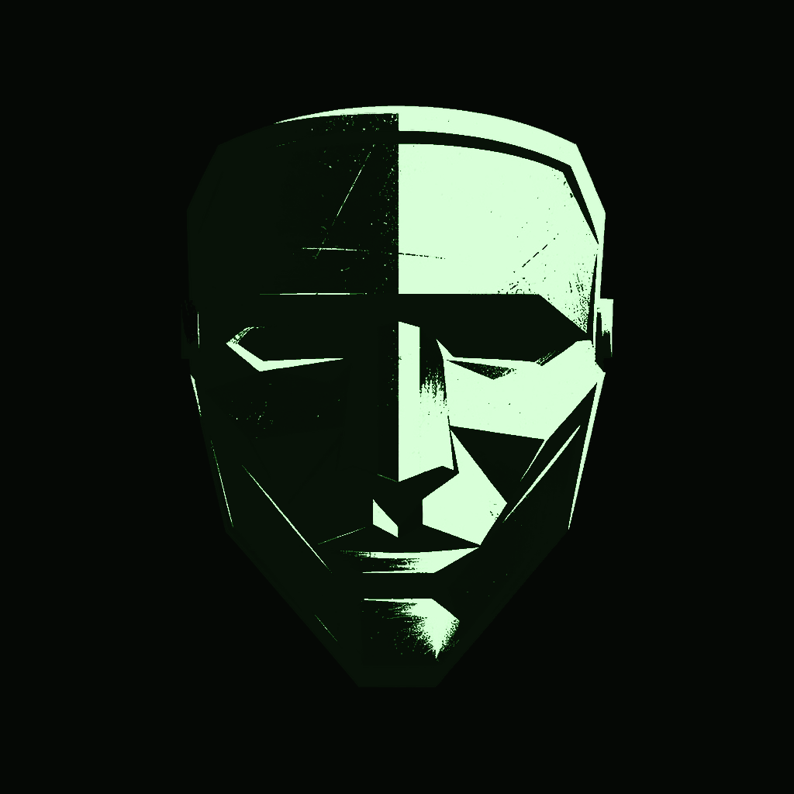
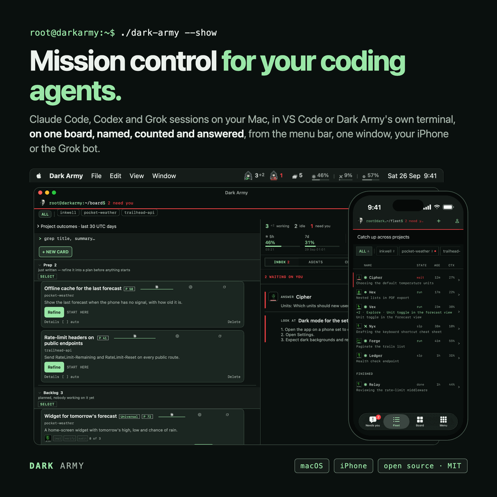
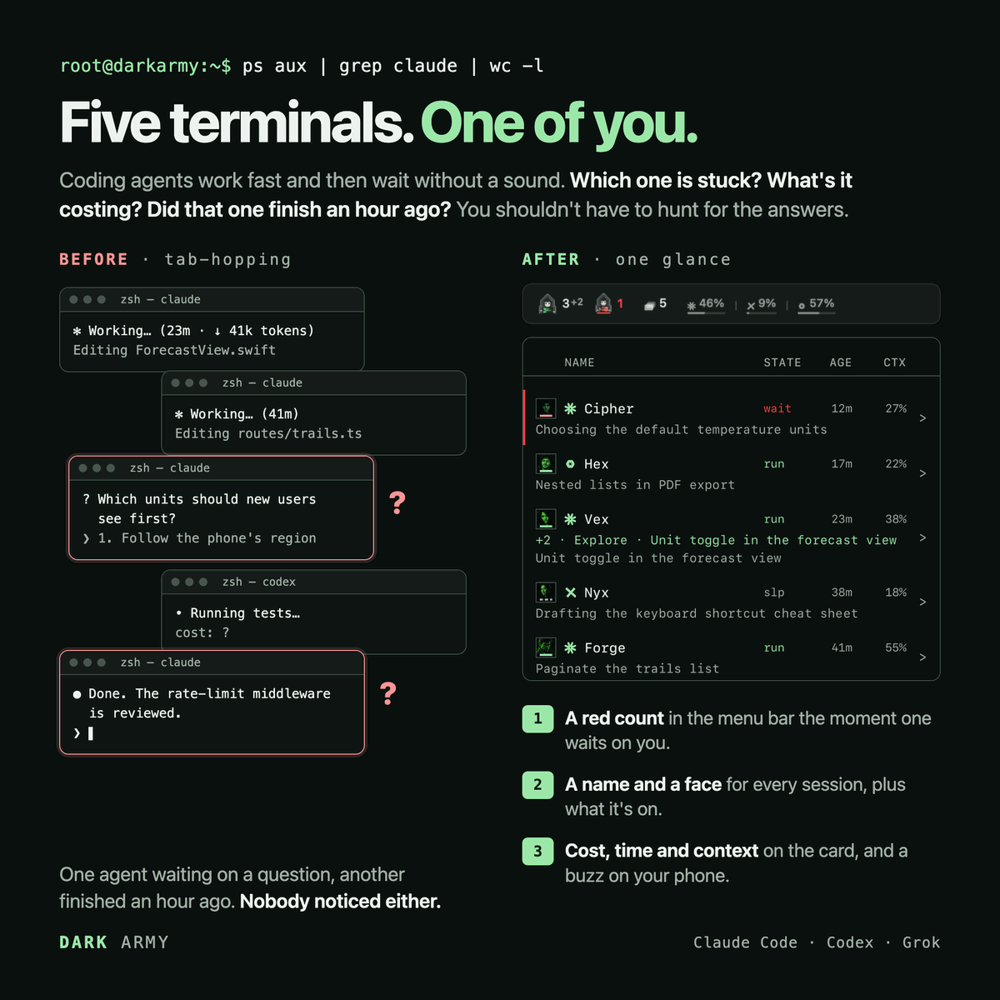
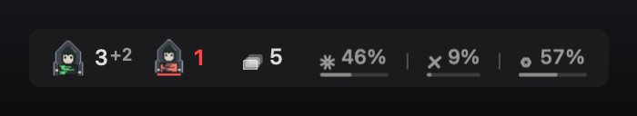
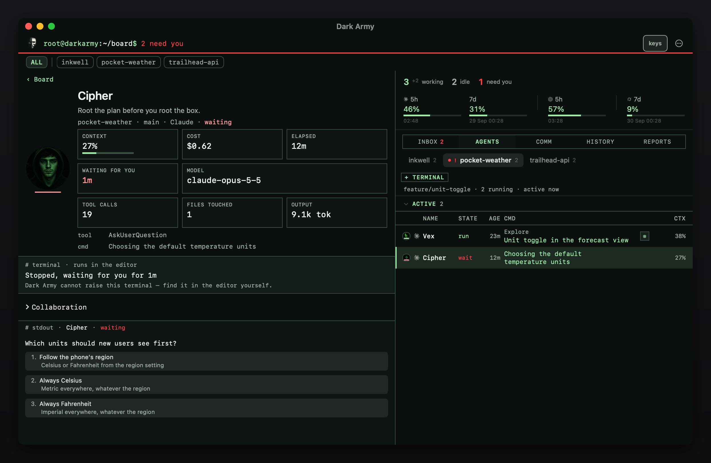
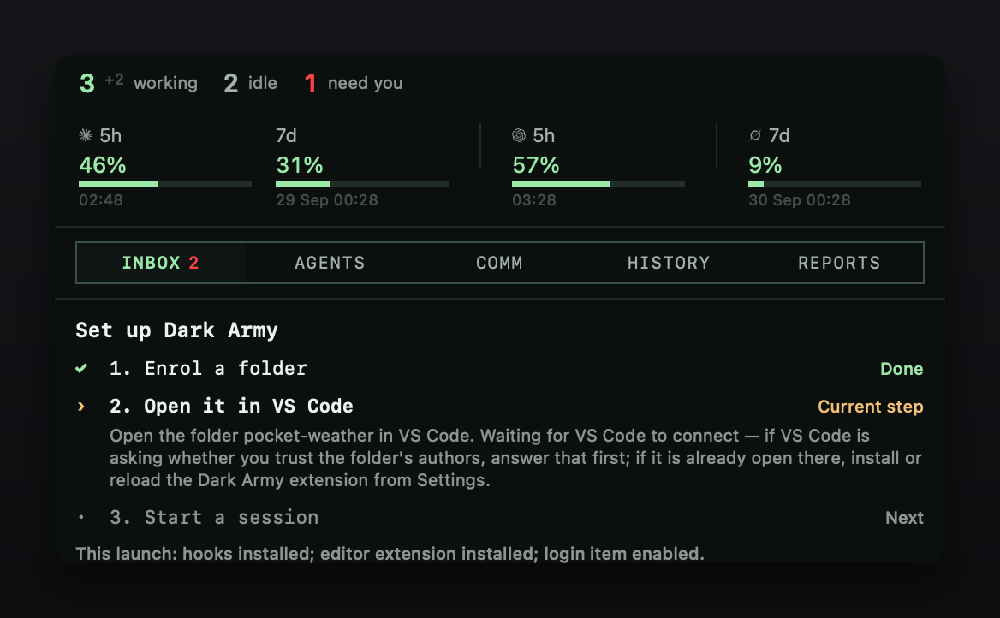
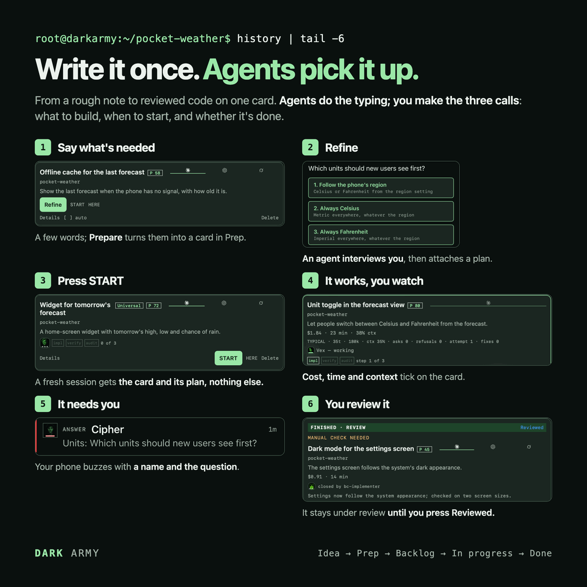
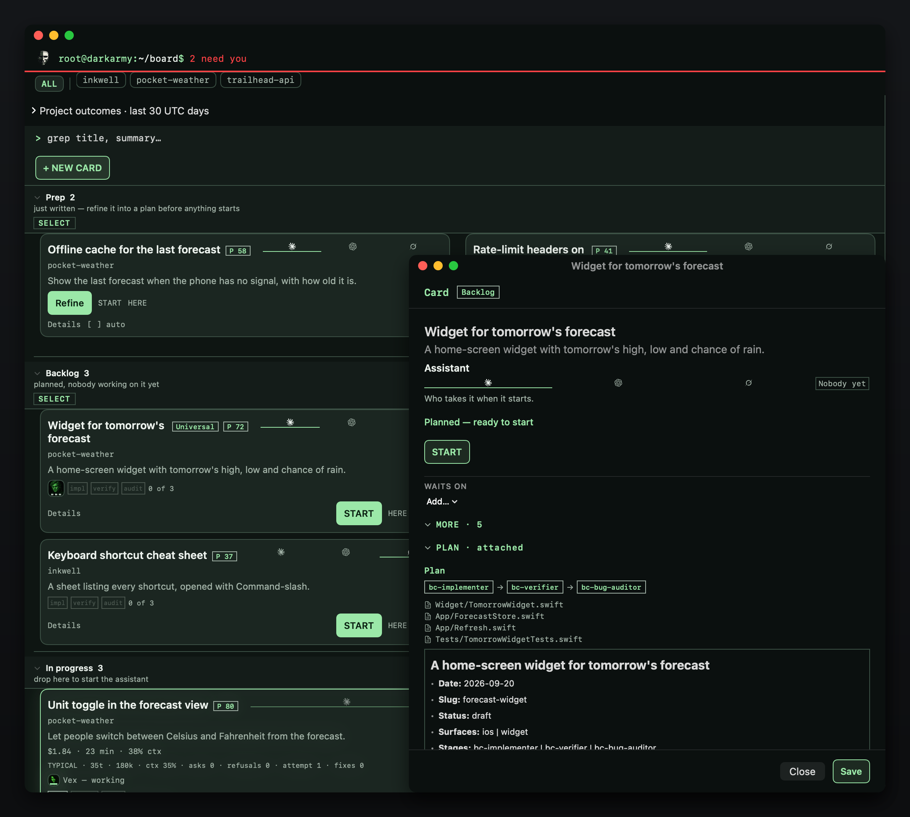
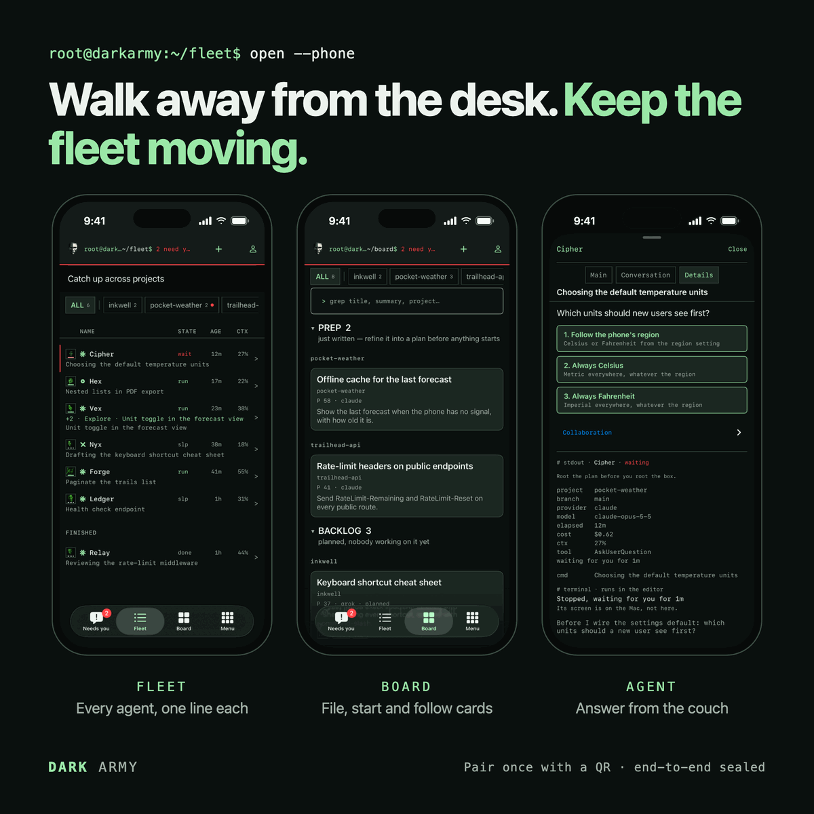

<p align="center">
  
</p>

<h1 align="center">Dark Army</h1>

<p align="center">
  
  
  
</p>

**Mission control for your coding agents.** Dark Army puts the Claude Code,
Codex and Grok sessions you run — in VS Code or its own terminal — on one
board, named, counted and answered: who is working, who needs you, what it
cost, and a card that turns an idea into a running agent.



## Why Dark Army



**Five terminals. One of you.** Coding agents work fast and then wait without a
sound. Run three or four at once and the same four questions come back every few
minutes; Dark Army answers each one where you already look.

- **Who is working?** The menu-bar strip: one face and a count for the agents
  working, a red count for the ones waiting on you, the cards still to do, and
  how full each assistant's usage window is.

  

- **Who is stuck waiting on me?** The window's **Inbox** lists everything
  waiting on a person, and nothing else: a question, a permission prompt, a
  card that asks for a hand-check. Press an entry and the **Agents** tab opens
  on that agent, with its question as buttons, a reply box, and Allow / Deny
  for a permission prompt, answered in place.

  

- **What has it cost, and how full is each context?** Every row says, and so
  does every card an agent is working on.
- **Where is the next piece of work written down?** On the board: one card per
  piece of work, from a rough idea in Prep to a plan in Backlog, an agent in
  In progress and a finished card in Done. Pressing **START** is what opens
  the agent. Nothing starts on its own.

Each agent gets a name and a face from a fixed cast, so "Cipher is blocked" is
something you can say out loud and act on. A paired iPhone carries the same
picture when you are away from the desk.

## Quick start

1. **Install.** Download `dark-army-macos-arm64.zip` from the latest release of
   [`androszr/dark-army`](https://github.com/androszr/dark-army/releases),
   unzip it and drag **Dark Army** into Applications. The app is ad-hoc signed,
   so the first open is refused: open **System Settings → Privacy & Security**
   and press **Open Anyway**. Or build it from source (Xcode and Python 3.11+):

   Dark Army requires the Claude Code CLI; Codex and Grok are optional.
   See [assistant permissions](docs/cli-permission-modes.md) for installation
   checks and what happens when an assistant asks to run a command.

   ```bash
   git clone https://github.com/androszr/dark-army.git && cd dark-army
   cd host && python3 -m venv .venv && .venv/bin/pip install -r requirements-dev.txt
   ./build.sh --allow-untagged --install
   ```

   `--allow-untagged` lets a working checkout build: without it the build
   refuses any tree that is not a clean, tagged release.
   **You'll see:** `/Applications/Dark Army.app`.

2. **Open it.** Dark Army installs its Claude Code hooks, the statusline
   collector and its VS Code extension (`dark-army.dark-army-ide`) by itself,
   and turns on launch at login. Click the face in the menu bar (either
   button) to open the window. **You'll see:** a resting face in the menu bar,
   and the window with a three-step checklist at the top of its rail.

   

3. **Enrol a project.** Press *Enrol a folder…* in the checklist and pick a
   project folder. Dark Army writes a small private key file into it
   (`.dark-army/key`, git-ignored) and watches nothing outside the
   folders you enrol. **You'll see:** step one ticked, *Open it in VS Code*
   next.

4. **Open it in VS Code.** Open that folder in a VS Code window.
   **You'll see:** step two ticked.

5. **Start a Claude Code session there.** Open a terminal in that folder and
   run `claude`; no prompt is needed. **You'll see:** its row under the
   project's tab on **Agents**, and the strip's working count go up while it
   runs.

6. **Your first "needs you".** Give the session something that makes it ask
   you a question. **You'll see:** a red count on the strip, a banner (allow
   notifications when macOS asks), and an *answer* entry on **Inbox**. Press
   the entry and pick one of its answers.

## A day with Dark Army



**Agents do the typing; you make the three calls:** what to build, when to
start, and whether it's done.

1. **+ NEW CARD** on the board writes an idea down. **Prepare** turns a
   sentence into a title, a summary and instructions (or press *fill in
   myself*). The card lands in **Prep**.
2. **Refine** opens a planning session on the card. It asks you at most a few
   questions, writes a plan and attaches it, and the card moves to
   **Backlog**.
3. **START** is armed by the first press and confirmed by the second (a card
   with no plan asks *Start unplanned?* first). It opens an agent in that
   project's terminal with the plan, and the card moves to **In progress**.
4. When the agent asks something, it appears on Inbox, on the strip, as a
   banner and on your phone. Answer from any of them.
5. The agent ends with a `## Work done` report. The card reaches **Done**
   when the agent closes it, when you drag it there, or when you press
   *Close terminal* on the finished session.

Nothing starts without a press. *Agents per project* (Settings → **Board**,
1 by default, up to 4) sets how many agents may work in one project at once; a
press beyond that queues the card and says what it is waiting for. *Start
queued cards automatically* (on by default) starts the next one when a place
frees.



## Cost and usage

- **The strip's meters** show the Claude, Grok and Codex usage windows; the
  window's rail shows the same readings as chips with their reset times. Both
  turn amber past 75% and red past 90%.
- **Every running card** carries cost so far, working minutes, context and
  attempts, plus a one-line reading of how the run is going (typical, large or
  worrying), on the board and in the card's window. A cost Dark Army cannot
  measure says "cost unknown" rather than $0.
- **History** (the window's fourth tab) is the ledger of what finished runs
  cost, per project and per assistant.
- **The phone's Usage tab** carries the same meters.
- Session titles, card priorities and **Prepare** use small helper calls on
  your own Claude account (Haiku). A card set to Codex or Grok prepares on that
  assistant's own cheap model instead.

## Your phone



Pair once: Settings → **Devices** → *Pair a device…*, and scan the QR code with
the phone. The app asks for Face ID on every open and has five tabs: Needs you,
Fleet, Board, Comm and Usage. A home-screen widget and a Lock Screen card show
the agent at the top of Needs you. At home it talks to the Mac over your Wi-Fi
(*Phone access*). Away from home it goes through a relay you deploy yourself
(*Away access*; the mailbox in `relay/`, plus the optional live line in
`relay-ws/` behind *Socket link*). Every frame is sealed with a key only your
two devices hold; the buzzes are not, and SECURITY.md says what they carry.

The phone app is **not on the App Store**. Build `ios/` in Xcode with your own
Apple developer team; [ios/README.md](ios/README.md) has the build.

## Optional extras

- **Reply and permission relay.** Settings → **Sessions** → *Session channel
  (new sessions)*, then start sessions with
  `claude --dangerously-load-development-channels server:dark-army`.
- **Grok and Codex.** Install their CLIs and their sessions appear beside
  Claude's. Codex rows can be watched and jumped to, and do less than
  Claude's: the full list is in [docs/reference.md](docs/reference.md).
- **No VS Code.** Settings → **Board** → *Dark Army's own terminal* starts
  cards on a terminal Dark Army hosts itself, shown in the window.
- **Mission Control.** The **Comm** tab is a standing chief-of-staff session
  you can ask about the whole board.
- **Auto-compact.** Settings → **Sessions** → *Compact full sessions* types
  `/compact` into a session that has filled its context.
- **Per-assistant models.** Settings → **Models**.
- **Dictation.** Settings → **General** → *Dictation* records a shortcut for speaking
  into the card composer.

## Safety in brief

- Everything stays on this Mac by default: every listener is on loopback,
  and the only outbound calls are the few usage reads listed in SECURITY.md.
- The phone and away doors are off until you switch them on, and every frame
  through them is sealed.
- Only folders you enrol are watched.
- Agents start only from your own press: START, a drag, a card you ticked to
  start when planned, or Mission Control; *Dark Army may start sessions*
  removes that entirely.
- A phone buzz shows the agent's question and the card's title on your Lock
  Screen and travels through Apple's push service in plaintext.
- The reply channel is the sharp edge, and it is off unless you turn it on.

What each part opens, sends and stores is in [SECURITY.md](SECURITY.md).

## Troubleshooting

**Nothing in the menu bar.** Check the log,
`~/Library/Logs/DarkArmy/dark-army.log` (rotated nightly, kept 7 days).

**The window does not open.** If the panel cannot run, an emergency menu
appears on the menu-bar item with Open Log, Restart and Quit. From source,
rebuild it with `cd panel && swift build -c release`.

**No sessions appear.** Most often the project is not enrolled: enrol it from
Settings → **Projects** → *Enrol a folder…*. Otherwise reinstall the hooks from
Settings → **Advanced** → *Reinstall hooks*. The hooks do not start the app:
while Dark Army is not running, events are dropped.

**Costs and context are blank.** Those come from Claude Code's statusline,
installed on every launch; *Restart* at the foot of the Settings sidebar puts it back.

**Jump, auto-compact or Close terminal do nothing.** They need the VS Code
extension: Settings → **Advanced** → *Reinstall VS Code extension*, then
reload the VS Code window.

**It will not quit.** *Kill switch — stop everything* at the foot of the Settings sidebar stops every
Dark Army process at once.

## Uninstall

Quit Dark Army (*Quit* at the foot of the Settings sidebar), then:

```bash
rm -rf "/Applications/Dark Army.app"
launchctl bootout gui/$(id -u) ~/Library/LaunchAgents/com.dark-army.menubar.plist
rm -f ~/Library/LaunchAgents/com.dark-army.menubar.plist
rm -rf ~/.dark-army                    # state, history, the hook scripts
rm -f ~/.bob-companion                 # on an upgraded Mac: the old name, a link
rm -rf ~/Library/Logs/DarkArmy         # the log
code --uninstall-extension dark-army.dark-army-ide
claude mcp remove -s user dark-army    # only if you turned the channel on
claude mcp remove -s user bob          # its legacy name, same condition
```

Then remove the `dark-army-*` hook entries, the `statusLine` command and the
`CLAUDE_CODE_DISABLE_TERMINAL_TITLE` env key from `~/.claude/settings.json`.
If you used Grok, delete `~/.grok/hooks/dark-army.json` and
`~/.grok/rules/dark-army.md`. If you used Codex, remove the groups naming
`dark-army-*` from `~/.codex/hooks.json` and run `codex mcp remove dark-army-board`
(and, on a Mac upgraded through the dual-name window,
`codex mcp remove bob-companion-board`).
Each enrolled project keeps its `.dark-army/` key folder (and, for now, the
old `.bob-companion/` one) until you delete them.

## Everything else

Every setting, how the parts fit together and the component map are in
[docs/reference.md](docs/reference.md).

## Contributing

See [CONTRIBUTING.md](CONTRIBUTING.md). Design proposals go under
`assets/proposals/`, which is git-ignored: only what the ingest tools bake out
of it is tracked.

## Why I built it

Day job is product, with a lot of agents and automation in it, and the
guardrails that come with a company. This is the side-project cockpit: a way to
move fast on small things, mostly iPhone apps and web pages, for fun. It is vibe
coded, by someone with limited programming experience, and very much a work in
progress. It works for me and it might work for you; or just steal the ideas.

## Credits

Built with [Claude Code](https://claude.com/claude-code). The components the app ships
with are credited in [THIRD_PARTY_NOTICES.md](THIRD_PARTY_NOTICES.md).
Copyright (c) 2026 Robert Androsz, as [LICENSE](LICENSE) states.

## License

MIT; see [LICENSE](LICENSE).
